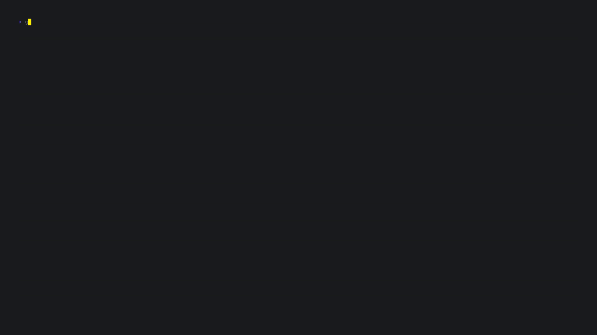
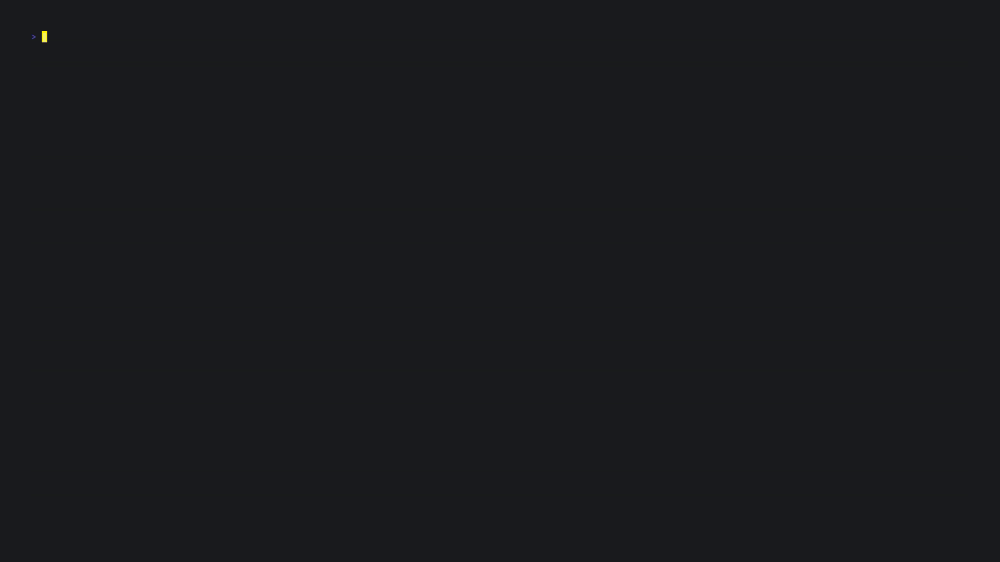

# goManageDocker

Do Docker commands slip your mind because you don't use Docker often enough? Sick of googling commands for everyday tasks? GoManageDocker is designed to NUKE this annoyance. 

Introducing **goManageDocker** (get it?)! This blazing fast TUI, made using Go and BubbleTea, will make managing your Docker objects a breeze. 

## Contents

1. [Install Instructions](#install-instructions)
2. [Features](#features)
3. [Configuration](#configuration)
4. [Roadmap](#roadmap)
5. [Found an issue?](#found-an-issue-)

## Install Instructions

### Unix

You can install the latest release of goManageDocker on UNIX systems with a simple bash script:

```
bash -c "$(curl -sLo- https://raw.githubusercontent.com/ajayd-san/gomanagedocker/main/install.sh)"
```

Start the program with `gmd`. 

### Build from source

Just build like any other Go binary: 

```
go install github.com/ajayd-san/gomanagedocker@3264acc
```

Start the program with `gomanagedocker` (You'll have to rename it to `gmd` if you want, the binary will be installed at your `$GOPATH`).

### Windows

You can get the latest precompiled binary from releases or you may build from source. 

Now, **goManageDocker 😏!!**

> [!NOTE]
> goManageDocker runs best on terminals that support ANSI 256 colors and designed to run while the **terminal is maximized**.

## Features

### **New in v1.3:**

1. You can now run and exec into an image directly from the images tab with  `x`

   

2. You can directly copy the ID to your clipboard of an object by pressing `c`.

   

**New in v1.2**: You can now run an image directly from the image tab by pressing `r`.

   

**New in v1.1.1**: Ability to perform `docker scout quickview` on any image (just press `s`).

   

1. Easy navigation with vim keybinds and arrow keys.
   
   

2. Exec into selected container with A SINGLE KEYSTROKE: `x`...How cool is that?

   

3. Delete objects using `d` (You can force delete with `D`, you won't have to answer a prompt this way)
   
   

4. Prune objects using `p`
   
   

5. start/stop/pause/restart containers with `s`, `t` and `r`
   
   

6. Filter objects with `/`
   
   

## Configuration

I've added support for config files from V1.2.

Place `gomanagedocker/gomanagedocker.yaml` in your XDG config folder and configure to your heart's content!

Default Configuration:  

```
config:
  Polling-Time: 500
  Tab-Order: [images, containers, volumes]
```

- Polling-Time: Set how frequently the program calls the docker API (measured in milliseconds, default: 500ms)
- Tab-Order: Set the order of tabs displayed, the keys must be `images`, `containers` and `volumes`. You can omit the names of the tabs you do not wish to see as well. Say I want to see `containers` tab first and do not want to see the `volumes` tab, I can set `Tab-Order: [containers, images]`

## Roadmap

- Make the program work with minimized terminal state
- Add a networks tab
- Add More Config Options

## Found an issue ?

Feel free to open a new issue, I will take a look ASAP.


